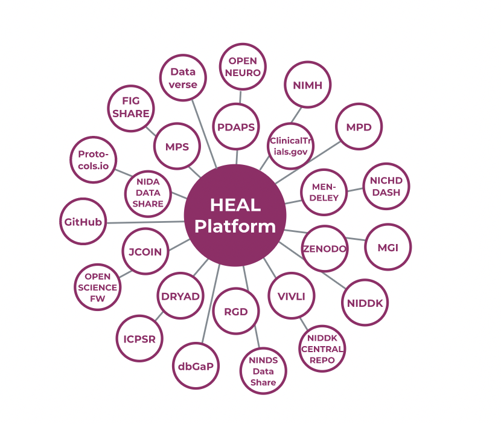
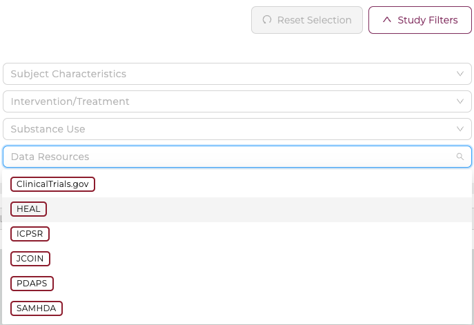

Data Management and Repositories
--------------------------------

To help HEAL investigators in the repository selection process, the HEAL Data Stewards at RENCI/RTI have developed [Repository Selection Criteria](https://www.healdatafair.org/resources/guidance/selection) and identified a number of recommended repositories. A HEAL-approved repository is a FAIR data repository that is NIH-approved and ideally has an API for metadata and data permissions calls.

The following is a non-exhaustive selection of repositories and resources currently made accessible through or leveraged by the Heal Platform:

<figure markdown>
  { width="600" }
  <figcaption>Current Data Resources on the HEAL Data Platform.</figcaption>
</figure>

Studies from different Data Resources can be filtered and selected on the [Discovery Page](#Discovery) in the Study Filters section (top panel):

<figure markdown>
  { width="500" }
  <figcaption>Studies can be filtered by Data Resource using their respective tags.</figcaption>
</figure>

Currently, the HEAL platform makes data available from the following FAIR Data Resources or Repositories:

For more information from NIH regarding public access and data sharing, visit [https://heal.nih.gov/about/public-access-data](https://heal.nih.gov/about/public-access-data).
