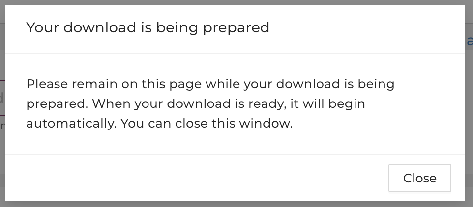
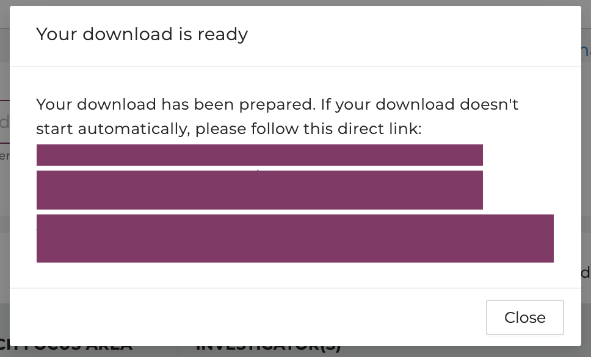
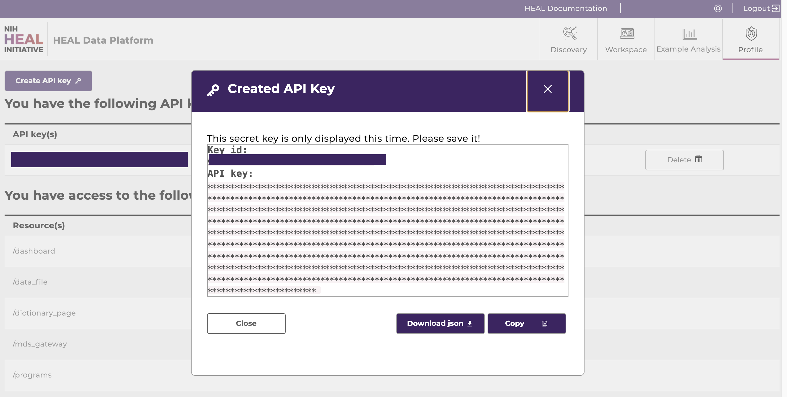
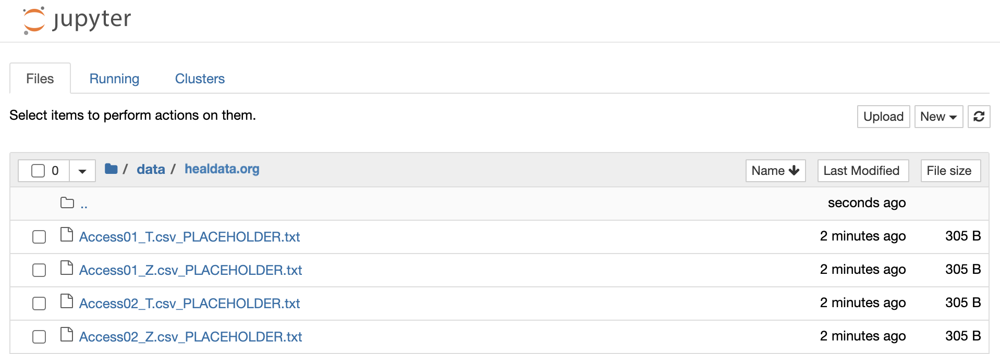
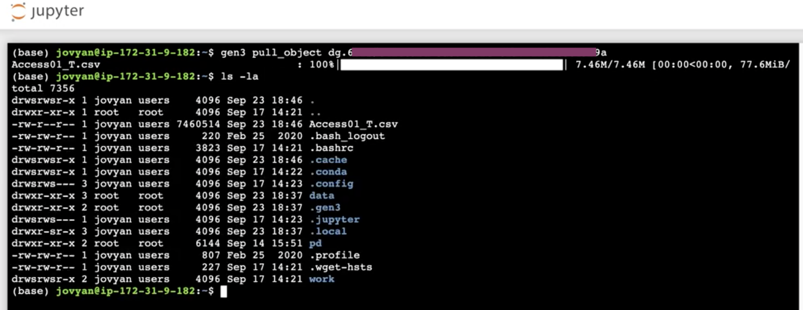
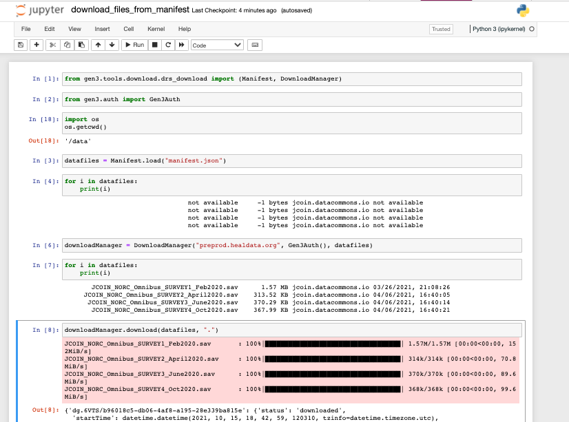

## 5\. Downloading Data Files

Users can download data files associated with a study by downloading the files directly from the Discovery page, or leveraging the CTDS-owned python software development kit (SDK) and the tool “Gen3-client” if the file size exceeds 250 MB.

Note that current studies that have datasets of more than 250 MB are those with the following project numbers: a) cdcwonder and b) deaarcos1.

Note, that accessing data files requires linked access to all FAIR enabled repositories, as described [here](#LinkingAccessTo). A pop-up window will remind users:


Users are reminded to link the account to all other FAIR enabled repositories, as described [here](#LinkingAccessTo).

### a) Download Data Files from the Discovery Page

Users can download data files up to sizes of 250 MB directly from the Discovery Page.  

Below you find the simple steps to do so.

1.  Navigate to the [Discovery Page](#Discovery). Link your accounts to FAIR repositories as described [here](#LinkingAccessTo).  
      
    
2.  Find the study of interest by using the [search features](#SearchFeatures) or the [list of accessible studies](#FindAvailableDatasets).  
      
    
3.  Select the clickable box next to the study.  
    Click on "Download ZIP", which will initiate the data download.  
    
    
    Select the study and click "Download ZIP".
    
      
    
4.  Users will be prompted with a window that shows the download is being prepared.  
    Please do not navigate away from this page until the download is complete.  
    
    
    After clicking "Download ZIP", your download is being prepared. Please do not navigate away from this page until the download is complete.
    
      
    
5.  Users will be notified once the download is ready. If the download doesn't start automatically, please follow the link prompted.  
    
    
    Users will be notified once the download is ready. Save the file(s) by selecting the directory using the prompted window.
    
      
    
6.  If the file size exceeds 250 MB, users will be notified to deselect studies to reduce the size or use other tools:  
    
    
    Users are advised to use other tools to download the files if the total file size exceeds 250 MB. [Please see the next section for a step-by-step guide using these tools](#DownloadFilesClientSDK).
    
      
    

### b) Download Data Files using the Gen3-client

In order to download data files above 250 MB, users will need to utilize the Gen3-client command line tool developed by the University of Chicago’s Center for Translational Data Science.

The current studies that have datasets of more than 250 MB are those with the following project numbers: a) cdcwonder and b) deaarcos1.

Find below a guide to download data files using the Gen3-client:

1.  Log in to the HEAL Platform on [healdata.org/login](https://healdata.org/login). Link your accounts to FAIR repositories as described [here](#LinkingAccessTo).  
      
    
2.  Find and select one or multiple studies of interest on the [Discovery Page](https://healdata.org/discovery). For multiple studies, select "Data Availability" in the top right corner, click “Available”, and choose multiple studies.
  
4.  Click on the button “Download Manifest".


Select a study of interest, then click on the button “Download Manifest".
     
5.  Create and download an API key from your [Profile Page](https://healdata.org/identity). Note where you save the API key on your local machine.  


    
Create an API key on the profile page.
    
      
      


Download the API key as json file and note the directory where the API key was saved for step 6.
    
      
      
    
6.  Download and configure the Gen3-client  
    a. Follow the download instructions of the Gen3-client [here](https://gen3.org/resources/user/gen3-client/#1-installation-instructions). The client can be downloaded [here](https://github.com/uc-cdis/cdis-data-client/releases/latest).  
      
    b. In your terminal, configure your profile using the following command:  
      
    > `gen3-client configure --profile=<profile_name> --cred=<credentials.json> --apiendpoint=<api_endpoint_url>`     
    
    
    Mac/Linux:   
    
    > `gen3-client configure --profile=demo   --cred=~/Downloads/demo-credentials.json --apiendpoint=https://healdata.org/`    
    
    Windows:   
    
    > `gen3-client configure --profile=demo   --cred=C:\Users\demo\Downloads\demo-credentials.json --apiendpoint=https://healdata.org/`     
    
    If the command was succesful, you should get the following output:

    ```10:08:20 Profile 'demo' has been configured successfully. ```

    If successfully executed, a configuration file will be stored under the directory the user specified under “cred”. For troubleshooting, refer to the instructions found [here](https://gen3.org/resources/user/gen3-client/#2-configure-a-profile-with-credentials).  
      
    c. Download files by using the following command, which references the manifest file name and its location:  
      
    > `gen3-client download-multiple --profile=<profile_name> --manifest=<manifest_file> --download-path=<path_for_files>      gen3-client download-multiple --profile=demo --manifest=manifest.json --download-path=downloads`      
    
    
    > `2021/06/03 16:48:46 Reading manifest...   200 B / 200 B [===================] 100.00% 0s   WARNING: flag "rename" was set to false in "original" mode, duplicated files under "downloads/" will be overwritten   Proceed? [y/n]: `

    Enter:

    > `y`
    
    
    Output:

    > `2021/06/03 16:48:47 Total number of GUIDs: 1   2021/06/03 16:48:47 Preparing file info for each file, please wait...   1 / 1 [============================================] 100.00% 0s   2021/06/03 16:48:47 File info prepared successfully   arcos_all_washpost.tsv.gz 6.41 GiB / 6.41 GiB [=======================================================] 100.00% 0s`
  

### c) Download Data Files in Workspaces using the Python SDK

Users can download data files to the workspaces by leveraging the CTDS-owned python software development kit (SDK). Follow instructions below.

1.  Log in to the Data Commons on [healdata.org/login](https://healdata.org/login). Link your accounts to FAIR repositories as described [here](#LinkingAccessTo).  
      
    
2.  Find and select one or multiple studies of interest on the [Discovery Page](https://healdata.org/discovery). Select "Data Availability" in the top right corner and click on “Available” to see all available studies.  
      
    
3.  Select a study and click on "Open in Workspace".  
      
      
    
4.  Select a workspace VM and click "Launch". Choose the "(Generic) Jupyter Notebook with R kernel" if you are familiar with setting up Python- or R-based Notebooks, or if you just exported one or multiple studies from the Discovery Page and want to start your custom analysis. Choose a VM with the name of the Notebook if you selected the studies relevant to a specific Notebook and want to work on the Notebook in interactive mode.  
    
    
    Available workspaces on the HEAL Platform (top). Users need to link accounts from other repositories (bottom; click [here to see how](#LinkingAccessTo)).
    
      
      
    
5.  Find all files under /data/healdata.org/ with the ending "PLACEHOLDER". These files can be directly downloaded either in the terminal or in a notebook cell.  
      
      
    
6.  Click on one file and copy the command and GUID.  
      
      
    
7.  Open a new terminal under "New".   
      
    
8.  *   Type in the following command to download the file to the terminal:  
    > `gen3 drs-pull object "guid"`  
          
      
          
        
    *   If you are working in a notebook, type in the following command into a code cell to download the file:  

    > `!gen3 drs-pull object "guid"`  
          
      
          
        
    *  If you use the R kernel, change the command into `system("gen3 drs-pull object 'guid'")`  
          
        
    *   Note, that you can also use the manifest.json to download in batches, see below: 
        
        Download files in batches with a file manifest using the commands shown above.
        
          
          
        
9.  The file(s) should be downloaded and is ready to be worked with in your Notebook.  
    
    
    Downloaded files can be found in your home directory.