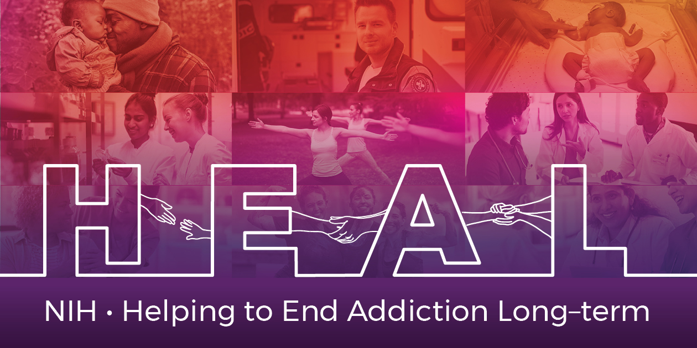

---
hide:
  - navigation
  - toc
---

<!--  -->

## The HEAL Platform

The [HEAL Platform](https://healdata.org/) is a cloud-based and multifunctional web interface that provides a secure environment for discovery and analysis of [NIH HEAL](https://heal.nih.gov/) results and data. It is designed to serve users with a variety of objectives, backgrounds, and specialties.

The HEAL Platform represents a [dynamic Data Ecosystem](https://heal.nih.gov/about/heal-data-ecosystem) that aggregates and hosts data from multiple resources to make data discovery and access easy for users.

The platform provides a way to search and query over study metadata and diverse data types, generated by different projects and organizations and stored across multiple secure repositories.

The HEAL platform also offers a secure and cost-effective cloud-computing environment for data analysis, empowering collaborative research and development of new analytical tools. New workflows and results of analyses can be shared with the HEAL community to enable collaborative, high-impact publications that address the opioid crisis.

The HEAL Platform is powered by the open-source [software “Gen3”](https://ctds.uchicago.edu/gen3) . Gen3 was created by and is actively developed at the University of Chicago’s Center for Translational Data Science (CTDS) with the aim of creating interoperable cloud-based data resources for the scientific research community.

Powered by  
[{: style="height:50px"}](https://ctds.uchicago.edu/gen3)

Watch the introduction video to the HEAL Platform below

  
If your Browser does not support watching this video, here's a [link to the video](videos/HEAL_UI_Demo_July_2021.mp4) instead.
