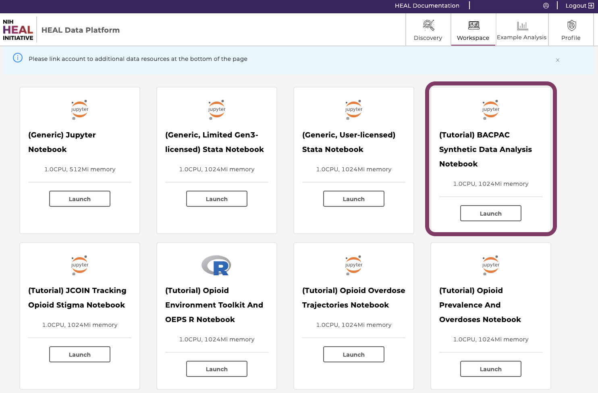
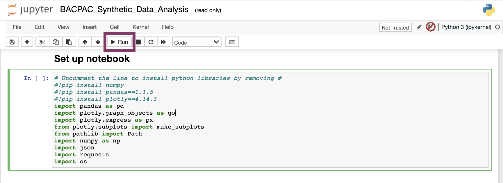

## Example Analyses

[The Example Analysis page](https://healdata.org/resource-browser) contains a collection of view-only tutorial Jupyter Notebooks that provide demo analyses of datasets published on the HEAL platform.

> This tab acts as a ['visual table of contents’](#CurrentlyAvailableNotebooks) of available HEAL datasets.

### HEAL Example Analysis

This video introduces users to the Example Analysis page, where users can browse Jupyter notebook demos to explore previous data analyses on the HEAL platform.  

<!-- TODO: use mkdocs-videos -->
<!--  -->
<video controls width="600">
<source src="videos/Opioid_Ovderdose_Traj_CDCWonder_Demo_2021-07-21.mp4" type="video/mp4">
<source src="videos/Opioid_Ovderdose_Traj_CDCWonder_Demo_2021-07-21.mp4" type="video/webm">
</video>
   
If your Browser does not support watching this video, here's a [link to the video](videos/Opioid_Ovderdose_Traj_CDCWonder_Demo_2021-07-21.mp4) instead.  
  

Currently available static Jupter Notebooks:

### Why tutorial Notebooks?

These notebooks will allow users to learn how to analyze and visualize data available on the HEAL platform - without having to take the additional steps of finding and exporting the data used by the tutorial first.

> All tutorial notebooks are static, view-only, and can be downloaded as `.html` files.  
> Find the notebooks in interactive mode in the [Workspace tab](#Workspaces).  
> Find below a description of how to [work with the tutorials in the workspaces](#WorkingTutorialNotebooksInteractively).  

These tutorial notebooks are meant to:

*   Give users a sense for how the platform can be used to analyze data.
*   Bring complementary datasets together.
*   Be used as a launching point for the users’ own custom analysis.
*   Spark imagination about how users can incorporate the platform data access, analysis, and collaboration tools into their own research and data analysis process and pipelines.

The “Example Analysis” tab will be regularly updated with new and exciting tutorial data analysis notebooks, as more datasets are published and brought together in novel ways on the Platform.

### Currently available Notebooks

Find below a list of notebooks that are currently available and which datasets they’re based on.

> Click [here](#Tutorials) to watch demo videos about how to use the tutorial Jupyter Notebooks as a launching point for your own custom analysis.

Please link your account to [all FAIR repositories](#LinkingAccessTo) before working with the Notebooks in interactive mode.

| Notebook Name | Project Title | Project Number | Datasets used | Language |
|---|---|---|---|---|
| BACPAC Synthetic Data Analysis | Back Pain Consortium (BACPAC) Research Program Data Integration, Algorithm Development and Operations Management Center | 1U24AR076730-01 | 1) participant_ SMART.tsv 2) substance_use_ SMART.tsv 3) physical_function_ SMART.tsv | Python |
| JCOIN Tracking Opioid Stigma | Methodology and Advanced Analytics Resource Center | 1U2CDA050098-01_a | 1) JCOIN_NORC_ Omnibus_SURVEY1_ Feb2020.sav 2) JCOIN_NORC_ Omnibus_SURVEY2_ April2020.sav 3) JCOIN_NORC_ Omnibus_SURVEY3_ June2020.sav 4) JCOIN_NORC_ Omnibus_SURVEY4_ Oct2020.sav | Python |
| Opioid Prevalence And Overdoses | 1) Drug Enforcement Administration Controlled Substances Tracking (DEA ARCOS)  2) Prescription Drug Abuse Policy System  2b) 3) CDC Wide-ranging Online Data for Epidemiologic Research (CDC WONDER) Mortality Multiple Cause-of-Death Public Use Record | 1) deaarcos1  2) 57b45d83d6 c9e7e8693ccdfd  3) cdcwonder | 1a) dea_arcos_drug_list.tsv 1b) dea_arcos_county_ population.tsv 1c) dea_arcos_combined_ county_annual.tsv 1d) dea_arcos_state_population.tsv  2a) 20170216-RM-Stat-Data.xlsx 2b) Naloxone_Data_09112020.xlsx 2c) 20180810_Good_Samaritan_ Law_Stat_Data.xlsx  3a) CDC_WONDER_unintentional_ overdoses.tsv 3b) CDC_WONDER_suicide_ overdoses.tsv 3c) monthly_unintentional_ overdoses.tsv | Python |
| Opioid Environment Toolkit and OEPS R (Watch tutorial) | Methodology and Advanced Analytics Resource Center | 1U2CDA050098-01_b | 1) ZIP_COUNTY.xlsx 2) us-wide-moudsCleaned.csv 3) zctas2018.shp | RStudio |
| Opioid Overdose Trajectories (Watch tutorial) | CDC Wide-ranging Online Data for Epidemiologic Research (CDC WONDER) Mortality Multiple Cause-of-Death Public Use Record | cdcwonder | 1) deaths_gender.xlsx 2) deaths_age_cat.xlsx 3) deaths_type_opioid.xlsx 4) cdc_wonder_year_cause_ hedegaard_et_al_2020.txt 5) cdc_wonder_year_cause_ state_hedegaard_et_al_2020.txt | Python |

### Working with the Tutorial Notebooks in interactive mode

*   Notebooks require linked access to all FAIR enabled repositories, as described [here](#LinkingAccessTo).

*   Code in the notebooks is editable, and users can import additional datasets and extend their analysis.

### Demo - How to find data and work on the Tutorial Notebooks

Below we describe the steps to export data from the Discovery Page tutorial Jupyter notebooks for one example tutorial notebook BACPAC\_Synthetic\_Data\_Analysis.ipynb (“BACPAC synthetic data analysis”)

Users must be logged in and have their accounts linked to the [FAIR repositories](#LinkingAccessTo) in order to follow the steps below.

1.  Go to the [Workspace tab](https://healdata.org/workspace) and click “Launch” on the “BACPAC Synthetic Data Analysis Notebook”. This may take a few minutes to load.  
    Note, that depending on the chosen notebook, this step varies to align with the name of the notebook/workspace.  
      
      
    
2.  Find and open the notebook in the landing directory by clicking on “BACPAC\_Synthetic\_Data\_Analysis.ipynb".  
      
      
    
3.  Click the first two cells and run them by clicking into the cell and either using shift+enter on the keyboard or selecting “Run”. Uncomment the commands as displayed below to install necessary packages.  
      
      
    
4.  Run the next cell to import the data files.  
      
      
    
5.  Explore the rest of the notebook. If you want to make changes, make sure to save the notebook as a new file in the directory "pd".  
      
    
6.  Make sure to terminate the workspace when the work is finished to reduce computational costs.

Note: Work must be saved in the directory "/pd" in order to remain accessible after workspace termination. Note, that Workspaces automatically shut down after 90 minutes of [idle time.](#AutomaticWorkspaceShutdown)