## Workspaces

HEAL Platform workspaces are secure data analysis environments in the cloud that can access data from one or more data resources. Workspaces include Jupyter notebooks, Python, and RStudio by default but can be configured to host virtually any application, including analysis workflows, data processing pipelines, or data visualization apps. In order to launch a workspace, users will need to request a Gen3 workspace account at "https://healportal.org/". There are two methods to support workspaces: grant-funded accounts paid for by your institution (STRIDES grant) or a STRIDES credit account supported by the NIH initiative. _Note, it may take several days for your account to be approved_.

New to Jupyter? Learn more about the popular tool for data scientists on [Jupyter.org](https://jupyter.org/) (disclaimer: CTDS is not responsible for the content).

### Guideline to get started

1. Users need to log in via [healdata.org/login](https://healdata.org/login) to access workspaces and link their funded account from [healportal.org](https://healportal.org).
  
2. After navigating to [healdata.org/workspace](https://healdata.org/workspace), users will discover a list of pre-configured virtual machine (VM) images, as shown below.  
      
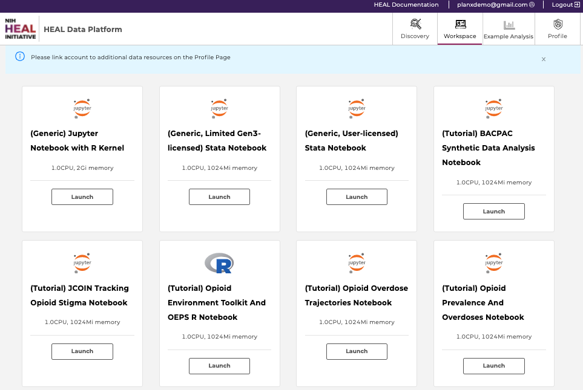

Available workspaces on the HEAL Platform (top). Users may need to link their accounts from other repositories (bottom); click [here to see how](#LinkingAccessTo).
    

*   **(Generic) Jupyter Notebook with R kernel:** Choose this VM if you are familiar with setting up Python- or R-based Notebooks, or if you just exported one or multiple studies from the Discovery Page and want to start your custom analysis.
*   **(Generic, User-licensed) Stata Notebook:** Choose this VM if you are familiar with STATA-based data analysis. This notebook requires a STATA license.
*   **Tutorial Notebooks:** Explore our Jupyter Notebook tutorials written in Python or RStudio, which pull data from various sources of the HEAL Data Ecosystem to leverage statistical programs and data analysis tools.  
      
    All interactive tutorial notebooks can be also found as [static version on the Notebook Browser tab](https://healdata.org/resource-browser); read more in the section ["Example Analysis"](#StaticNotebooks).  
      
    Feel free to edit and experiment with this collection of notebooks. They are your personal copies!  
      
    *   _Notebooks in Python_: (1) BACPAC Synthetic Data Analysis, (2) JCOIN Tracking Opioid Stigma, (3) Opioid Overdose Trajectories, (4) Opioid Prevalence And Overdoses
    *   _Notebooks in RStudio_: (1) Opioid Environment Toolkit and OEPS

  
3. Click “Launch” on any of the above workspace flavors to spin up a copy of that VM. Note: Launching the VM may take several minutes.  
      
    
    
    The status of launching the workspace is displayed after clicking on “Launch”.
    
      
    
  
4. After launching, the home folders are displayed, one of which is the user's persistent drive ("pd").  
<figure markdown>
  
  <figcaption> The /pd directory is a user’s persistent drive. </figcaption>
</figure>      
    
5. Select the **/pd** folder. Only files saved in the **/pd** directory will remain available after termination of a workspace session.  
     <figure markdown>
  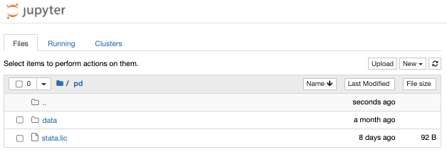
  <figcaption>     New files or licenses should be saved in the the /pd directory if users need to access them after restarting the workspaces. </figcaption>
</figure> 

- **Attention:** Any personal files in the folder “data” will be lost. Personal files in the directory /pd will persist.  
- Do not save files in the "data" and “data/healdata.org” folders.  
- The folder “healdata.org” in the “data” folder will host the data files you have exported from the Discovery Page.  

  
6. Start a new notebook by clicking “New” in the top right corner and choose between Python 3 or R Studio as the base programmatic language.  
<figure markdown>
  
  <figcaption> Start a new notebook under “New”. </figcaption>
</figure>     

    
7. **Experiment away!** Code blocks are entered in cells, which can be executed individually or all at once. Code documentation and comments can also be entered in cells, and the cell type can be set to support Markdown.  
      
    Results, including plots, tables, and graphics, can be generated in the workspace and downloaded as files.  
      
    Users can import data files directly into the Notebook code after selecting files from the ["Discovery Page"](#SelectBringFilesDiscoveryToWorkspace). An example is shown below.  
      
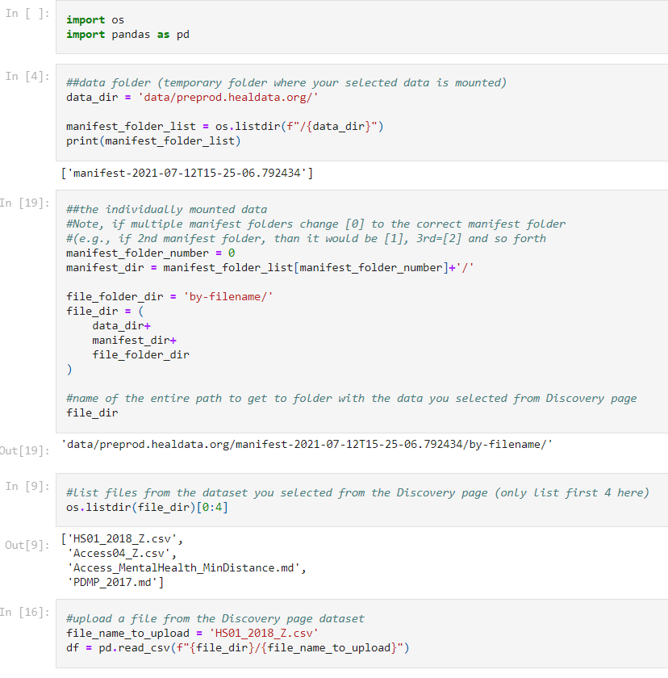  
    
    
8. Do not forget to terminate your workspace once your work is finished to be mindful of the cost-intensive computational effort. **Note, that Workspaces automatically shut down after 90 minutes of [idle time.](#AutomaticWorkspaceShutdown)**  
<figure markdown>
  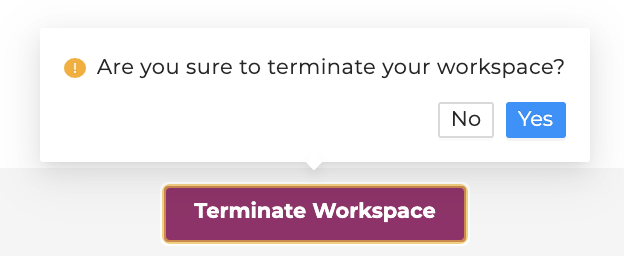
  <figcaption> Do not forget to terminate your workspace once your work is finished. Unterminated workspaces continue to accrue computational costs. </figcaption>
</figure>           

Further reading: read more about how to download data files into the Workspaces [here](#DownloadFilesSDKWorkspaces).

### Upload, save, and download Files/Notebooks

Users can **upload** data files or Notebooks from the local machine to the home directory by clicking on “Upload” and access them in the Notebook (see below).
<figure markdown>
  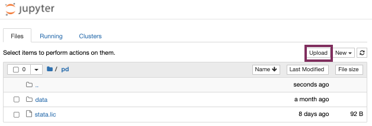
  <figcaption> Upload data files or Notebooks to the workspace by clicking on “Upload” in the top right corner. On the upload screen, find your text file (in this example, it is "this\_is\_a\_demo.txt") to upload from your local computer. </figcaption>
</figure>  
  
Then run in the cells, for example:  
> import os   
import pandas as pd   
os.chdir('/data')   
demo_df = pd.read_csv('/this_is_a_demo.txt', sep='\t')   
demo_df.head()  

Users can **save** the notebook by clicking "File" - "Save as", as shown below.
<figure markdown>
  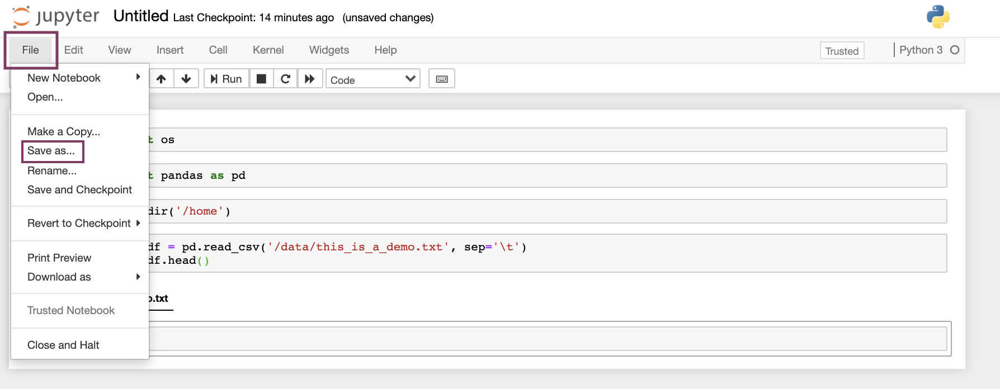
  <figcaption> Save the notebook under “File” - "Save as". </figcaption>
</figure>  

Users can **download** notebooks by clicking "File" - "Download as", as shown below.
<figure markdown>
  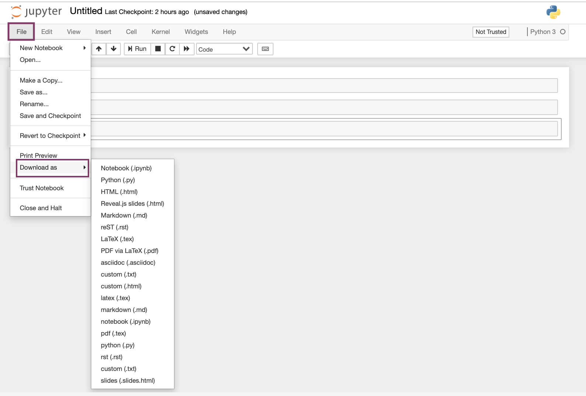
  <figcaption> Download the notebook as ".ipynb". </figcaption>
</figure> 

### Environments, Languages, and Tools

The following **environments** are available in the workspaces:

*   Jupyter  
    
*   RStudio  
    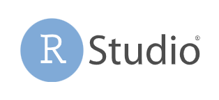  
    

The following **programmatic languages** are available in Jupyter Notebooks:

*   RStudio ([read more](#PythonRInJupyter))
*   Python 3 ([read more](#PythonRInJupyter))
*   STATA ([read more](#STATAinNotebooks))

The following **tools** are available in Jupyter Notebooks:

*   GitHub ([read GitHub documentation](https://docs.github.com/en))

### Python 3 and RStudio in Jupyter

Both Python 3 and RStudio are available in Jupyter Notebooks.  
Users can expect to be able to use typical Python or RStudio packages, such as PyPI or CRAN. For Python and RStudio, users can start a new notebook under "New", as shown below.
<figure markdown>
  
  <figcaption> Find Python 3 or RStudio when starting a new notebook under “New”. </figcaption>
</figure> 

### STATA in Jupyter

STATA is available as language in Jupyter notebooks (either in Python or R kernels), but requires a license and a specific workspace.

Users need to first choose the following workspace "(Generic, User-licensed) Stata Notebook" in order to be able to use STATA:
<figure markdown>
  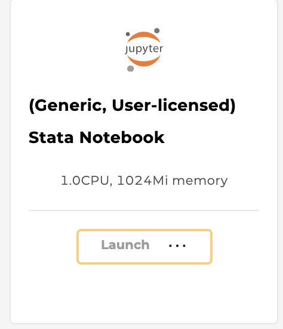
  <figcaption> Select this workspace to use STATA in the notebook. </figcaption>
</figure> 

Users need to upload a license `stata.lic` to the /pd folder by selecting "Upload" (top right).
<figure markdown>
  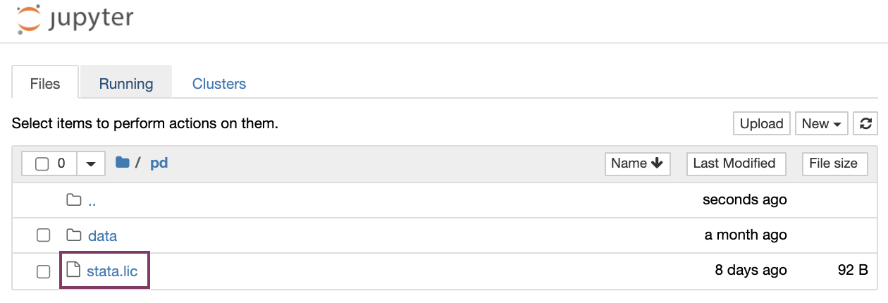
  <figcaption> If the upload was successful, the license appears in the directory /pd. </figcaption>
</figure> 

_Note_, that uploading the license can also be achieved programmatically by opening a new terminal window under "New" - "Terminal", finding the directory /pd by typing: `cd pd` . Then, create a file using vim: `vim stata.lic` . This will open the file in the terminal. Users can copy the license, then hit `:` + `wq`.

Then, users need to start a new notebook under "New" (choose either R or Python). Run the following code in the first cell:  
> import stata_setup
stata_setup.config("/usr/local/stata17", "mp") 

This will return the following:
<figure markdown>
  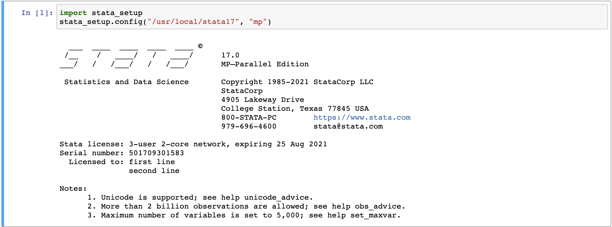
  <figcaption> Setup the license in the first cell. </figcaption>
</figure> 

Users can then begin using the notebook by typing in known STATA commands, for example `%% stata . describe` .

### Troubleshooting

*   If the kernel died, make sure to be logged in on 1) [the Login Page](#LoginPage) 2) [have enabled access to the FAIR enabled repository](#LinkingAccessTo)

### Automatic Workspace Shutdown

Workspaces automatically shut down after 90 minutes of idle time and a pop-up window will remind users before the workspace shuts down.
<figure markdown>
  
  <figcaption> A pop-up window will remind users to navigate back to the workspaces page in order to save the data. </figcaption>
</figure> 

After the workspace has been shut down, users will be notified with the following pop-up window.
<figure markdown>
  
  <figcaption> Workspaces automatically shut down after 90 minutes of idle time. </figcaption>
</figure> 
